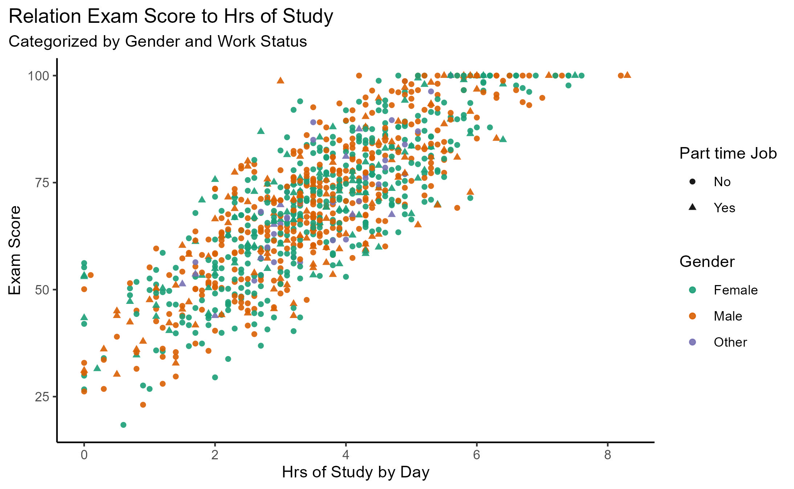
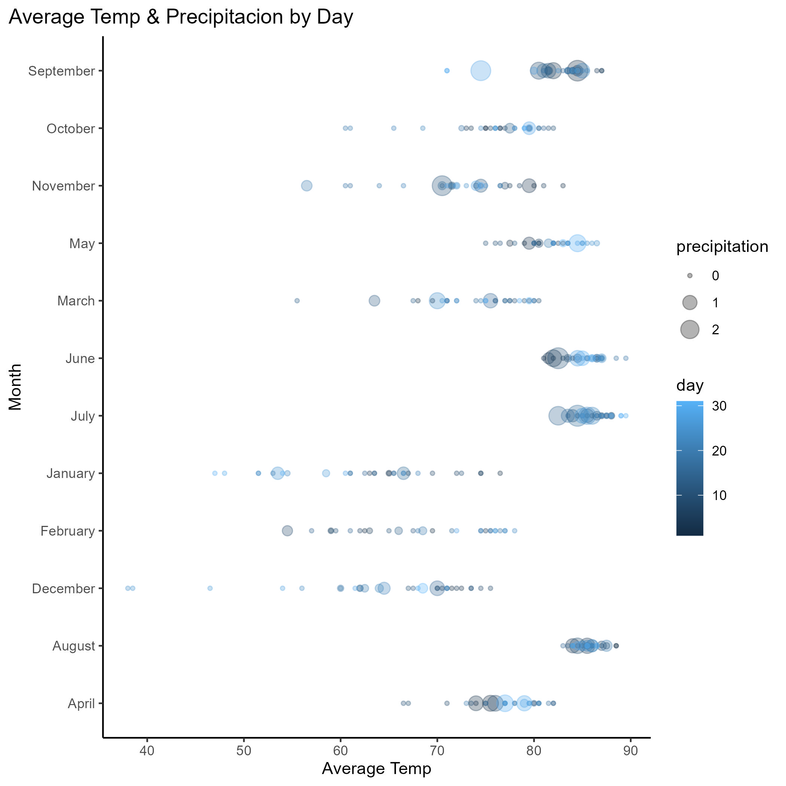

# Data Visualization and Reproducible Research

> Rene Perez. 

The following is a sample of products created during the _"Data Visualization and Reproducible Research"_ course.

## Project 01
In this project, I explored _The Billboard Summer Hits and the Students Performance data set_; on this file, I am focusing in the _Students Performance_, I want find the relationship between the Exam Score
and the other features like _time in netflix_, _study hrs_ and others, so I explored the data set creating plot and a multiple linear regression analysis.
Please the Find the code and report in the`project_01/` folder

**Sample data visualization:** 

****

  

  

  

  

#### Linear Regression table

<table style="text-align:center"><tr><td colspan="2" style="border-bottom: 1px solid black"></td></tr><tr><td style="text-align:left"></td><td><em>Dependent variable:</em></td></tr>
<tr><td></td><td colspan="1" style="border-bottom: 1px solid black"></td></tr>
<tr><td style="text-align:left"></td><td>exam_score</td></tr>
<tr><td colspan="2" style="border-bottom: 1px solid black"></td></tr><tr><td style="text-align:left">age</td><td>-0.012</td></tr>
<tr><td style="text-align:left"></td><td>(0.074)</td></tr>
<tr><td style="text-align:left"></td><td></td></tr>
<tr><td style="text-align:left">genderMale</td><td>0.146</td></tr>
<tr><td style="text-align:left"></td><td>(0.348)</td></tr>
<tr><td style="text-align:left"></td><td></td></tr>
<tr><td style="text-align:left">genderOther</td><td>0.793</td></tr>
<tr><td style="text-align:left"></td><td>(0.866)</td></tr>
<tr><td style="text-align:left"></td><td></td></tr>
<tr><td style="text-align:left">study_hours_per_day</td><td>9.575***</td></tr>
<tr><td style="text-align:left"></td><td>(0.116)</td></tr>
<tr><td style="text-align:left"></td><td></td></tr>
<tr><td style="text-align:left">social_media_hours</td><td>-2.602***</td></tr>
<tr><td style="text-align:left"></td><td>(0.145)</td></tr>
<tr><td style="text-align:left"></td><td></td></tr>
<tr><td style="text-align:left">netflix_hours</td><td>-2.282***</td></tr>
<tr><td style="text-align:left"></td><td>(0.158)</td></tr>
<tr><td style="text-align:left"></td><td></td></tr>
<tr><td style="text-align:left">part_time_jobYes</td><td>0.211</td></tr>
<tr><td style="text-align:left"></td><td>(0.414)</td></tr>
<tr><td style="text-align:left"></td><td></td></tr>
<tr><td style="text-align:left">attendance_percentage</td><td>0.143***</td></tr>
<tr><td style="text-align:left"></td><td>(0.018)</td></tr>
<tr><td style="text-align:left"></td><td></td></tr>
<tr><td style="text-align:left">sleep_hours</td><td>1.992***</td></tr>
<tr><td style="text-align:left"></td><td>(0.138)</td></tr>
<tr><td style="text-align:left"></td><td></td></tr>
<tr><td style="text-align:left">diet_qualityGood</td><td>-0.683*</td></tr>
<tr><td style="text-align:left"></td><td>(0.378)</td></tr>
<tr><td style="text-align:left"></td><td></td></tr>
<tr><td style="text-align:left">diet_qualityPoor</td><td>-0.272</td></tr>
<tr><td style="text-align:left"></td><td>(0.473)</td></tr>
<tr><td style="text-align:left"></td><td></td></tr>
<tr><td style="text-align:left">exercise_frequency</td><td>1.450***</td></tr>
<tr><td style="text-align:left"></td><td>(0.084)</td></tr>
<tr><td style="text-align:left"></td><td></td></tr>
<tr><td style="text-align:left">parental_education_levelHigh School</td><td>-0.160</td></tr>
<tr><td style="text-align:left"></td><td>(0.396)</td></tr>
<tr><td style="text-align:left"></td><td></td></tr>
<tr><td style="text-align:left">parental_education_levelMaster</td><td>-0.411</td></tr>
<tr><td style="text-align:left"></td><td>(0.508)</td></tr>
<tr><td style="text-align:left"></td><td></td></tr>
<tr><td style="text-align:left">parental_education_levelNone</td><td>-0.702</td></tr>
<tr><td style="text-align:left"></td><td>(0.633)</td></tr>
<tr><td style="text-align:left"></td><td></td></tr>
<tr><td style="text-align:left">internet_qualityGood</td><td>-0.473</td></tr>
<tr><td style="text-align:left"></td><td>(0.373)</td></tr>
<tr><td style="text-align:left"></td><td></td></tr>
<tr><td style="text-align:left">internet_qualityPoor</td><td>-0.082</td></tr>
<tr><td style="text-align:left"></td><td>(0.503)</td></tr>
<tr><td style="text-align:left"></td><td></td></tr>
<tr><td style="text-align:left">mental_health_rating</td><td>1.944***</td></tr>
<tr><td style="text-align:left"></td><td>(0.060)</td></tr>
<tr><td style="text-align:left"></td><td></td></tr>
<tr><td style="text-align:left">extracurricular_participationYes</td><td>-0.014</td></tr>
<tr><td style="text-align:left"></td><td>(0.364)</td></tr>
<tr><td style="text-align:left"></td><td></td></tr>
<tr><td style="text-align:left">Constant</td><td>7.177***</td></tr>
<tr><td style="text-align:left"></td><td>(2.503)</td></tr>
<tr><td style="text-align:left"></td><td></td></tr>
<tr><td colspan="2" style="border-bottom: 1px solid black"></td></tr><tr><td style="text-align:left">Observations</td><td>1,000</td></tr>
<tr><td style="text-align:left">R2</td><td>0.902</td></tr>
<tr><td style="text-align:left">Adjusted R2</td><td>0.900</td></tr>
<tr><td style="text-align:left">Residual Std. Error</td><td>5.342 (df = 980)</td></tr>
<tr><td style="text-align:left">F Statistic</td><td>473.908*** (df = 19; 980)</td></tr>
<tr><td colspan="2" style="border-bottom: 1px solid black"></td></tr><tr><td style="text-align:left"><em>Note:</em></td><td style="text-align:right">*p<0.1; **p<0.05; ***p<0.01</td></tr>
</table>

 

 

 

 

#### **Summary**

This is a very strong model. The most important predictors of exam performance are:

    📚 Study hours (positive)

    📱 Social media and 📺 Netflix use (negative)

    🛏️ Sleep (positive)

    💪 Exercise and 😊 Mental health (positive)

    🏫 Attendance (positive)

*****
*****

## Project 02

In this project, I explored _the California Housing Data set_, and find the relationship between the price of house, 
and proximity to the ocean; for instance, I explored the data set creating plot and a multiple linear regression analysis.
Please the Find the code and report in the `project_02/` folder.

**California Housing:** 

### **Linear Regression Output**

<table style="text-align:center"><tr><td colspan="2" style="border-bottom: 1px solid black"></td></tr><tr><td style="text-align:left"></td><td><em>Dependent variable:</em></td></tr>
<tr><td></td><td colspan="1" style="border-bottom: 1px solid black"></td></tr>
<tr><td style="text-align:left"></td><td>median_house_value</td></tr>
<tr><td colspan="2" style="border-bottom: 1px solid black"></td></tr><tr><td style="text-align:left">longitude</td><td>-26,812.990***</td></tr>
<tr><td style="text-align:left"></td><td>(1,019.651)</td></tr>
<tr><td style="text-align:left"></td><td></td></tr>
<tr><td style="text-align:left">latitude</td><td>-25,482.190***</td></tr>
<tr><td style="text-align:left"></td><td>(1,004.702)</td></tr>
<tr><td style="text-align:left"></td><td></td></tr>
<tr><td style="text-align:left">housing_median_age</td><td>1,072.520***</td></tr>
<tr><td style="text-align:left"></td><td>(43.886)</td></tr>
<tr><td style="text-align:left"></td><td></td></tr>
<tr><td style="text-align:left">total_rooms</td><td>-6.193***</td></tr>
<tr><td style="text-align:left"></td><td>(0.791)</td></tr>
<tr><td style="text-align:left"></td><td></td></tr>
<tr><td style="text-align:left">total_bedrooms</td><td>100.556***</td></tr>
<tr><td style="text-align:left"></td><td>(6.869)</td></tr>
<tr><td style="text-align:left"></td><td></td></tr>
<tr><td style="text-align:left">population</td><td>-37.969***</td></tr>
<tr><td style="text-align:left"></td><td>(1.076)</td></tr>
<tr><td style="text-align:left"></td><td></td></tr>
<tr><td style="text-align:left">households</td><td>49.617***</td></tr>
<tr><td style="text-align:left"></td><td>(7.451)</td></tr>
<tr><td style="text-align:left"></td><td></td></tr>
<tr><td style="text-align:left">median_income</td><td>39,259.570***</td></tr>
<tr><td style="text-align:left"></td><td>(338.005)</td></tr>
<tr><td style="text-align:left"></td><td></td></tr>
<tr><td style="text-align:left">ocean_proximityINLAND</td><td>-39,284.300***</td></tr>
<tr><td style="text-align:left"></td><td>(1,744.258)</td></tr>
<tr><td style="text-align:left"></td><td></td></tr>
<tr><td style="text-align:left">ocean_proximityISLAND</td><td>152,901.900***</td></tr>
<tr><td style="text-align:left"></td><td>(30,741.880)</td></tr>
<tr><td style="text-align:left"></td><td></td></tr>
<tr><td style="text-align:left">ocean_proximityNEAR.BAY</td><td>-3,954.052**</td></tr>
<tr><td style="text-align:left"></td><td>(1,913.339)</td></tr>
<tr><td style="text-align:left"></td><td></td></tr>
<tr><td style="text-align:left">ocean_proximityNEAR.OCEAN</td><td>4,278.134***</td></tr>
<tr><td style="text-align:left"></td><td>(1,569.525)</td></tr>
<tr><td style="text-align:left"></td><td></td></tr>
<tr><td style="text-align:left">Constant</td><td>-2,269,954.000***</td></tr>
<tr><td style="text-align:left"></td><td>(88,013.880)</td></tr>
<tr><td style="text-align:left"></td><td></td></tr>
<tr><td colspan="2" style="border-bottom: 1px solid black"></td></tr><tr><td style="text-align:left">Observations</td><td>20,433</td></tr>
<tr><td style="text-align:left">R2</td><td>0.646</td></tr>
<tr><td style="text-align:left">Adjusted R2</td><td>0.646</td></tr>
<tr><td style="text-align:left">Residual Std. Error</td><td>68,656.950 (df = 20420)</td></tr>
<tr><td style="text-align:left">F Statistic</td><td>3,111.608*** (df = 12; 20420)</td></tr>
<tr><td colspan="2" style="border-bottom: 1px solid black"></td></tr><tr><td style="text-align:left"><em>Note:</em></td><td style="text-align:right">*p<0.1; **p<0.05; ***p<0.01</td></tr>
</table>

### **Executive Summary (Linear Regression Analysis)**

1. The model fits reasonably well (R² ≈ 0.65).

2. Most variables are statistically significant.

3. median_income is the strongest positive predictor.

4. Location features (longitude, latitude, ocean_proximity) are very important.

5. Population and housing structure (rooms, households) affect value but may be entangled in multicollinearity[^1].

[^1]:Multicollinearity happens when two or more predictor variables in a regression model are highly correlated with each other. This means they contain overlapping information, which makes it hard for the model to determine which variable is actually influencing the outcome.

****
****

## Project 03

In this project, I explored _different visualizations, using geom_point(), geom_density(), and other ggplot visualizations;
next I will show a Tampa weather plot._

**Sample data visualization:** 

**Summary of Insights:**

+ Hot months (Jun–Aug) are warm and often wet, especially June and July.

+ Cold months (Dec–Feb) have lower average temperatures and relatively less rainfall.

+ Transitional months (Mar–May, Sep–Nov) show mixed weather, with both dry and wet days.

### Moving Forward

_Next steps:_

* Keep exploring the ggplot, SF, and other visualization packages.

* Work in visualizations for machine learning models.

* Keep working on mapping visualizations for spatial data.
