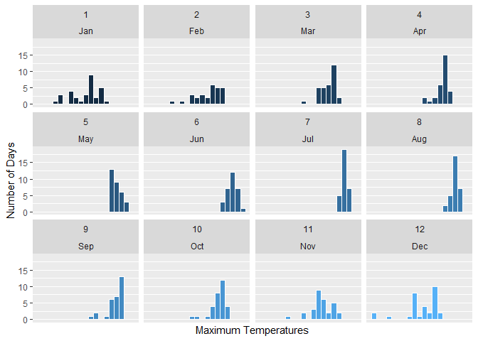
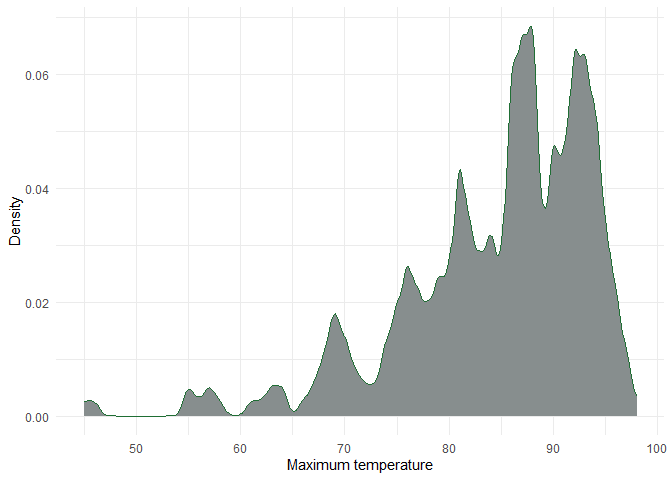
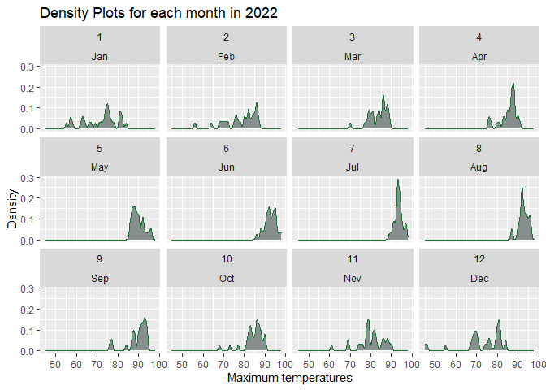
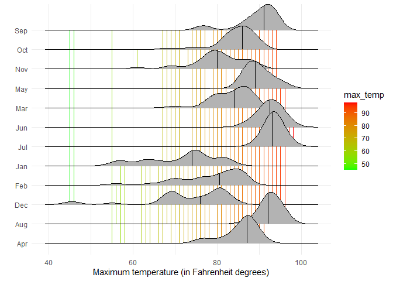
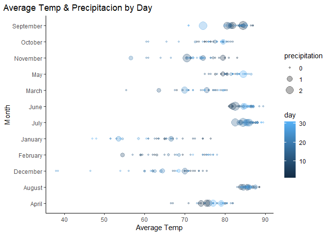
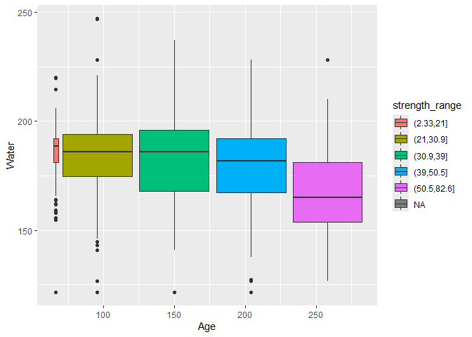
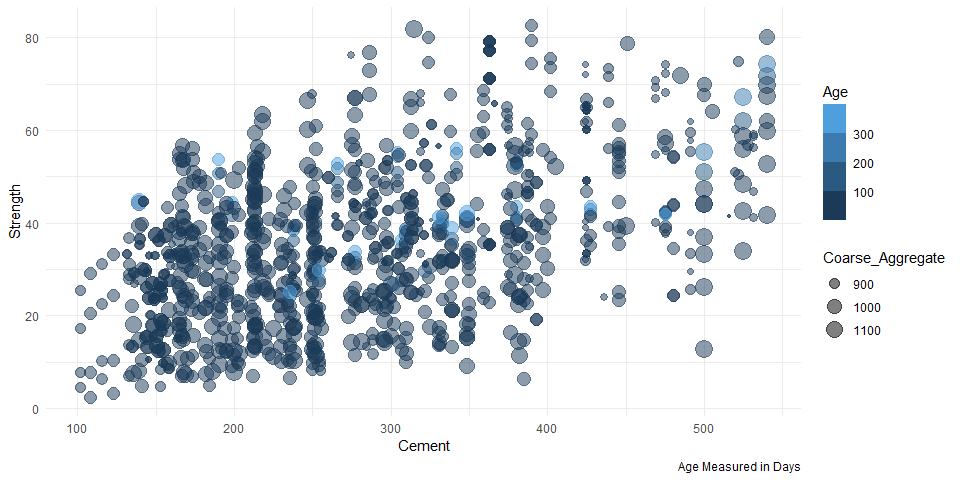

# Data Visualization Project 03


In this exercise you will explore methods to create different types of data visualizations (such as plotting text data, or exploring the distributions of continuous variables).


## PART 1: Density Plots

Using the dataset obtained from FSU's [Florida Climate Center](https://climatecenter.fsu.edu/climate-data-access-tools/downloadable-data), for a station at Tampa International Airport (TPA) for 2022, attempt to recreate the charts shown below which were generated using data from 2016. You can read the 2022 dataset using the code below: 


``` r
library(tidyverse)
weather_tpa <- read_csv("https://raw.githubusercontent.com/aalhamadani/datasets/master/tpa_weather_2022.csv")
# random sample 
sample_n(weather_tpa, 30)
```

```
## # A tibble: 30 × 7
##     year month   day precipitation max_temp min_temp ave_temp
##    <dbl> <dbl> <dbl>         <dbl>    <dbl>    <dbl>    <dbl>
##  1  2022     4    12          0          88       66     77  
##  2  2022    10    21          0          77       54     65.5
##  3  2022     5     4          0          88       73     80.5
##  4  2022     5    11          0          86       64     75  
##  5  2022    11    16          0.14       79       62     70.5
##  6  2022     7    30          0          97       81     89  
##  7  2022     9     9          0.13       88       75     81.5
##  8  2022     6    23          0          93       79     86  
##  9  2022     9    12          0.03       91       77     84  
## 10  2022    12    22          0.15       69       59     64  
## # ℹ 20 more rows
```

See Slides from Week 4 of Visualizing Relationships and Models (slide 10) for a reminder on how to use this type of dataset with the `lubridate` package for dates and times (example included in the slides uses data from 2016).

Using the 2022 data: 

(a) Create a plot like the one below:


``` r
tpa_clean <- weather_tpa %>%
unite("doy", year, month, day, sep = "-") %>%
mutate(doy = ymd(doy),
max_temp = as.double(max_temp),
min_temp = as.double(min_temp),
precipitation = as.double(precipitation))
```


``` r
ggplot(data = weather_tpa, mapping = aes(x = as.double(max_temp),
                                        fill = month))+
  
  geom_histogram(binwidth =3,  color = "white", boundary = 1)+
  scale_x_continuous(breaks = seq(0, 12, by = 1)) + 
  facet_wrap(vars(month(month), strip = month.abb[month]))+
  guides(fill = FALSE) +
  #theme_minimal() +
  labs(x = "Maximum Temperatures",
       y = "Number of Days")
```

```
## Warning: The `<scale>` argument of `guides()` cannot be `FALSE`. Use "none" instead as
## of ggplot2 3.3.4.
## This warning is displayed once every 8 hours.
## Call `lifecycle::last_lifecycle_warnings()` to see where this warning was
## generated.
```

<!-- -->


Hint: the option `binwidth = 3` was used with the `geom_histogram()` function.

(b) Create a plot like the one below:


``` r
ggplot(data = weather_tpa, aes(x = max_temp)) +
  geom_density(bw = 0.5,
               color="#1f6e34",
               fill="#878e8e")+
  theme_minimal() +
  labs(x = "Maximum temperature",
       y = "Density")
```

<!-- -->


Hint: check the `kernel` parameter of the `geom_density()` function, and use `bw = 0.5`.

(c) Create a plot like the one below:


``` r
ggplot(data = weather_tpa, aes(x = max_temp)) +
  geom_density(bw = 0.5,
               color="#1f6e34",
               fill="#878e8e")+
  #theme_minimal() +
  labs(x = "Maximum temperatures",
       y = "Density",
       title = "Density Plots for each month in 2022")+
  facet_wrap( vars(month(month), strip = month.abb[month]))
```

<!-- -->


Hint: default options for `geom_density()` were used. 

(d) Generate a plot like the chart below:


``` r
library(ggplot2)
ggplot(data = weather_tpa, aes(x =  max_temp,
                               y=   month.abb[month]))+
  
  
  geom_density_ridges_gradient(aes(colour = max_temp)) +
  geom_segment(aes(xend = max_temp, yend = month, colour = max_temp)) +
    scale_color_gradient  (low = 'green', high = 'red')+

  #geom_density_ridges() +
    #scale_color_brewer()+

  #scale_fill_viridis_c( n = 256, alpha = 1, begin = 0, end = 1, direction = 1, option = "plasma") +
  stat_density_ridges(quantile_lines = TRUE, quantiles = 2)+
  theme_minimal()+
  labs(x ="Maximum temperature (in Fahrenheit degrees)",
       y = "") 
```

```
## Picking joint bandwidth of 1.93
```

```
## Warning: The following aesthetics were dropped during statistical transformation:
## colour.
## ℹ This can happen when ggplot fails to infer the correct grouping structure in
##   the data.
## ℹ Did you forget to specify a `group` aesthetic or to convert a numerical
##   variable into a factor?
```

```
## Picking joint bandwidth of 1.93
```

<!-- -->


Hint: use the`{ggridges}` package, and the `geom_density_ridges()` function paying close attention to the `quantile_lines` and `quantiles` parameters. The plot above uses the `plasma` option (color scale) for the _viridis_ palette.


(e) Create a plot of your choice that uses the attribute for precipitation _(values of -99.9 for temperature or -99.99 for precipitation represent missing data)_.


``` r
ggplot(data = weather_tpa, mapping = aes(x = ave_temp,
                                  y = month.name[ month],
                                  size = precipitation,
                                  colour = day))+
  
geom_point(alpha = .3) +
  theme_classic()+
  labs(title = "Average Temp & Precipitacion by Day",
    x = "Average Temp",
       y = "Month") +
  theme(plot.title.position = "plot" )
```

<!-- -->

**Summary of Insights:**

+ Hot months (Jun–Aug) are warm and often wet, especially June and July.

+ Cold months (Dec–Feb) have lower average temperatures and relatively less rainfall.

+ Transitional months (Mar–May, Sep–Nov) show mixed weather, with both dry and wet days.

****

## PART 2 

> **You can choose to work on either Option (A) or Option (B)**. Remove from this template the option you decided not to work on. 


### Option (B): Data on Concrete Strength 

Concrete is the most important material in **civil engineering**. The concrete compressive strength is a highly nonlinear function of _age_ and _ingredients_. The dataset used here is from the [UCI Machine Learning Repository](https://archive.ics.uci.edu/ml/index.php), and it contains 1030 observations with 9 different attributes 9 (8 quantitative input variables, and 1 quantitative output variable). A data dictionary is included below: 


Variable                      |    Notes                
------------------------------|-------------------------------------------
Cement                        | kg in a $m^3$ mixture             
Blast Furnace Slag            | kg in a $m^3$ mixture  
Fly Ash                       | kg in a $m^3$ mixture             
Water                         | kg in a $m^3$ mixture              
Superplasticizer              | kg in a $m^3$ mixture
Coarse Aggregate              | kg in a $m^3$ mixture
Fine Aggregate                | kg in a $m^3$ mixture      
Age                           | in days                                             
Concrete compressive strength | MPa, megapascals


Below we read the `.csv` file using `readr::read_csv()` (the `readr` package is part of the `tidyverse`)


``` r
concrete <- read_csv("../data/concrete.csv", col_types = cols())
```


Let us create a new attribute for visualization purposes, `strength_range`: 


``` r
new_concrete <- concrete %>%
  mutate(strength_range = cut(Concrete_compressive_strength, 
                              breaks = quantile(Concrete_compressive_strength, 
                                                probs = seq(0, 1, 0.2))) )
```


1. Explore the distribution of 2 of the continuous variables available in the dataset. Do ranges make sense? Comment on your findings.

2. Use a _temporal_ indicator such as the one available in the variable `Age` (measured in days). Generate a plot similar to the one shown below. Comment on your results.


``` r
colnames(new_concrete)
```

```
##  [1] "Cement"                        "Blast_Furnace_Slag"           
##  [3] "Fly_Ash"                       "Water"                        
##  [5] "Superplasticizer"              "Coarse_Aggregate"             
##  [7] "Fine_Aggregate"                "Age"                          
##  [9] "Concrete_compressive_strength" "strength_range"
```

``` r
sapply(new_concrete, function(x) sum(is.na(x)))
```

```
##                        Cement            Blast_Furnace_Slag 
##                             0                             0 
##                       Fly_Ash                         Water 
##                             0                             0 
##              Superplasticizer              Coarse_Aggregate 
##                             0                             0 
##                Fine_Aggregate                           Age 
##                             0                             0 
## Concrete_compressive_strength                strength_range 
##                             0                             1
```

``` r
new_concrete
```

```
## # A tibble: 1,030 × 10
##    Cement Blast_Furnace_Slag Fly_Ash Water Superplasticizer Coarse_Aggregate
##     <dbl>              <dbl>   <dbl> <dbl>            <dbl>            <dbl>
##  1   540                  0        0   162              2.5            1040 
##  2   540                  0        0   162              2.5            1055 
##  3   332.               142.       0   228              0               932 
##  4   332.               142.       0   228              0               932 
##  5   199.               132.       0   192              0               978.
##  6   266                114        0   228              0               932 
##  7   380                 95        0   228              0               932 
##  8   380                 95        0   228              0               932 
##  9   266                114        0   228              0               932 
## 10   475                  0        0   228              0               932 
## # ℹ 1,020 more rows
## # ℹ 4 more variables: Fine_Aggregate <dbl>, Age <dbl>,
## #   Concrete_compressive_strength <dbl>, strength_range <fct>
```


``` r
ggplot(data= new_concrete, mapping = aes(x = Age,
                                          y = Water,
                                         fill = strength_range,
                                          )) +
  geom_boxplot()
```

<!-- -->


#### **Plot Analysis**

1. Strength Improves with Age and Lower Water Content:

+ Concrete samples with the highest strength (50.5–82.6 MPa) tend to be older (around 250 days) and have the lowest water content.

+ In contrast, low-strength samples (2.33–21 MPa) are generally younger and have higher water content.

2. Water Content Decreases with Age:

+ As concrete ages increase from ~30 to 250 days, the median water content tends to decrease.

+ This trend reflects a deliberate reduction in water to achieve better performance in long-cured concrete.

3. Mid-Strength Groups Show Higher Variability:

+ The strength ranges between ~30 and 50 MPa show a wide spread in water content, especially in samples aged 100–200 days.

+ This indicates diverse mix designs targeting intermediate strength levels.

4. High-Strength Mixes Are More Controlled:

+ Concrete in the highest strength group not only uses less water but also shows less variability, suggesting stricter mix control and quality standards.

5. Outliers Exist Across All Groups:

+ Some samples show unusually high or low water content, especially among younger concrete, likely reflecting experimental variations or suboptimal mixes.


*******


3. Create a scatterplot similar to the one shown below. Pay special attention to which variables are being mapped to specific aesthetics of the plot. Comment on your results. 


``` r
ggplot(data = new_concrete, mapping = aes(x= Concrete_compressive_strength,
                                          y = Cement,
                                          colour = Age,
                                          size = Coarse_Aggregate)) +
  geom_point(alpha = 0.5) +
  scale_color_binned() +
  labs(x = "Strength",
       y = "Cement",
       caption = "Age Measured in Days") +
  theme_minimal()+
  coord_flip()
```

<!-- -->

#### **Plot Analysis:**

_Observations:_

* **Positive Trend (Age vs. Strength):** There appears to be a general positive trend between "Age Measured in Days" and "Strength" (on the Y-axis). As the concrete ages, its strength generally tends to increase, although there's significant scatter in the data.

* **Distribution of Strength:** Concrete strength values are widely distributed at different ages, with a considerable spread, especially as age increases.
* **Effect of Coarse Aggregate:** The size of the points, representing "Coarse_Aggregate," is varied across the plot. It's difficult to visually discern a clear, strong direct relationship between the amount of coarse aggregate and the "Strength" or "Age" from this plot alone, as all aggregate sizes are present across the spectrum of strengths and ages.
* **Age as Color Redundancy:** The "Age" mapped to color reinforces the x-axis information. For example, darker blue points (older concrete) are generally found more towards the right side of the plot, while lighter blue points (younger concrete) are more towards the left.

_Summary_

>This plot investigates how the "Strength" of concrete develops over "Age," while also showing the influence of "Coarse_Aggregate" content through point size. The plot broadly supports the idea that concrete strength increases with age, but also highlights the variability influenced by other factors like coarse aggregate content.
